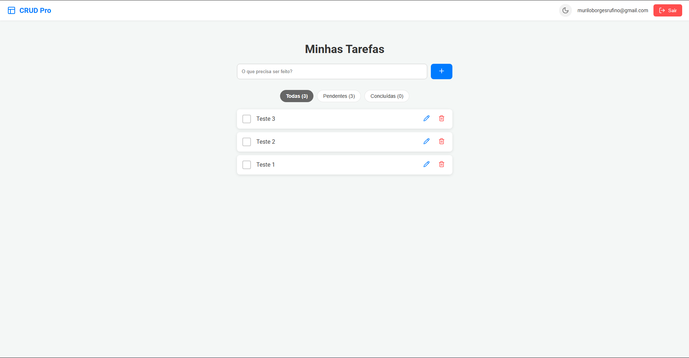
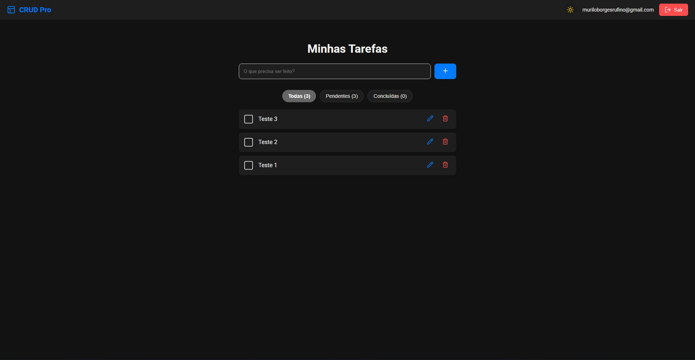
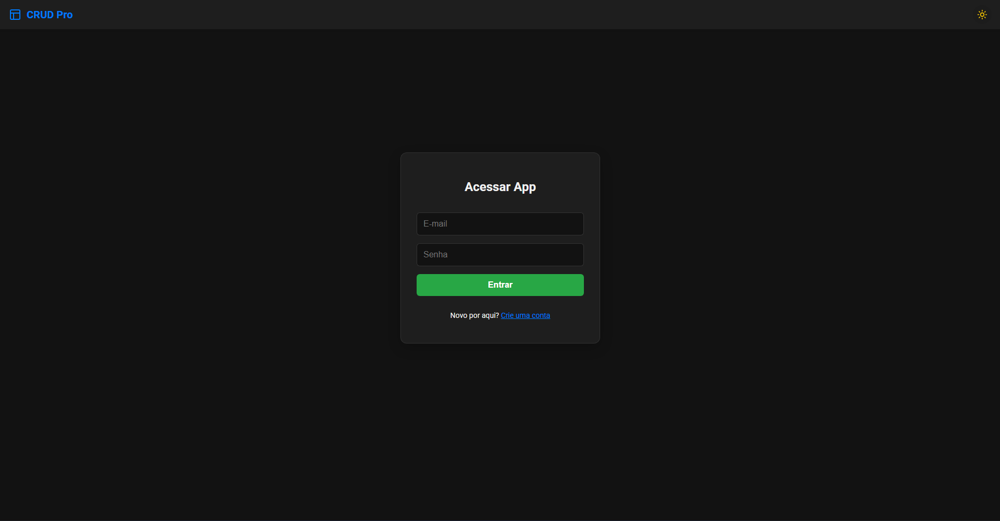

# 🚀 CRUD Pro - Gerenciador de Tarefas Full Stack

O **CRUD Pro** é uma aplicação de gerenciamento de tarefas (To-Do List) moderna e responsiva, focada em produtividade e experiência do usuário. O projeto conta com persistência de dados em tempo real e um sistema dinâmico de temas.

---

## ✨ Funcionalidades

- **Autenticação Segura:** Login e Cadastro de usuários integrados ao Firebase Auth.
- **Persistência em Nuvem:** Todas as tarefas são salvas no Google Firestore.
- **Interface Inteligente:**
  - Suporte completo a **Dark Mode** (Modo Escuro) sincronizado via Context API.
  - Filtros de tarefas: *Todas*, *Pendentes* e *Concluídas*.
  - Notificações interativas com `react-hot-toast` (incluindo confirmação de exclusão).
- **Design Adaptável:** Layout limpo e intuitivo para diferentes tamanhos de tela.

## 🛠️ Tecnologias Utilizadas

- **Frontend:** React.js
- **Backend/Database:** Firebase (Authentication & Firestore)
- **Estilização:** CSS Dinâmico (Variáveis CSS)
- **Navegação:** React Router DOM
- **Notificações:** React Hot Toast
- **Ícones:** Lucide-React

## 📸 Screenshots

  
  
  

---

## 🚀 Como Executar o Projeto

1. **Clone o repositório:**

    git clone [https://github.com/murilo-estudos/crud-pro.git](https://github.com/murilo-estudos/crud-pro.git)

2. **Instale as dependências:**

    npm install

3. **Configure o Firebase:**
Crie um arquivo *.env* na raiz do projeto e adicione suas credenciais:

    REACT_APP_FIREBASE_API_KEY=sua_key
    REACT_APP_FIREBASE_AUTH_DOMAIN=seu_domain
    ...

4. **Inicie o servidor local:**

    npm start

📄 Licença
Este projeto está sob a licença MIT. Veja o arquivo LICENSE para mais detalhes.

Desenvolvido por Murilo Borges 🚀
